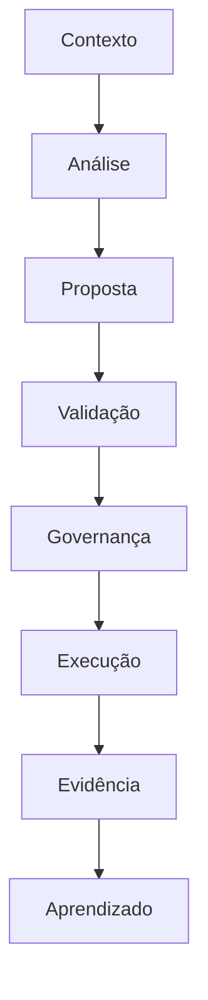
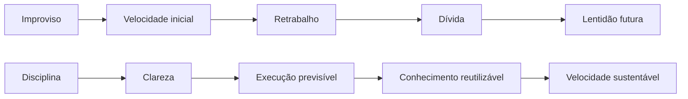
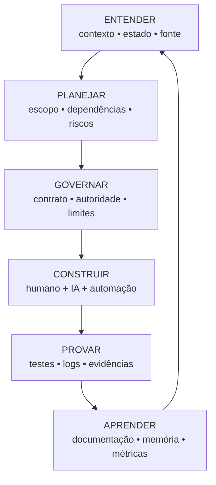

# 🜂 Manifesto ARCHON
## Conhecimento, engenharia e inteligência na era da IA

> **Márcio é a origem. ARCHON é a abstração. SSAG é uma manifestação. A prática é a prova.**

## 1. ARCHON não sou eu

ARCHON nasceu daquilo que aprendi construindo, errando, corrigindo, administrando projetos, integrando sistemas, lidando com legado, usando Inteligência Artificial e tentando transformar conhecimento disperso em capacidade institucional.

Mas ARCHON não é minha identidade.

Não é um título.
Não é um cargo.
Não é uma persona.

ARCHON é uma abstração dos princípios que procuro aplicar quando construo.

Se essa filosofia possuir valor, ela deve poder sobreviver a mim, ser questionada por outras pessoas e tornar-se melhor do que aquilo que fui capaz de formular sozinho.

## 2. O ponto de partida

A Inteligência Artificial reduziu radicalmente o custo da execução.

Hoje podemos gerar código, documentação, testes, análises, interfaces e automações em uma escala que poucos anos atrás exigiria equipes inteiras.

Isso é extraordinário.

Mas produzir mais não significa compreender mais.

Uma sociedade capaz de gerar sistemas em enorme velocidade, mas incapaz de compreender suas dependências, riscos, limites e consequências, não se tornou necessariamente mais inteligente.

Por isso não defendo humanos contra IA.

Defendo:

> **humanos com IA, sem terceirizar à máquina a responsabilidade de compreender aquilo que delegamos.**

## 3. A tese ARCHON

A máquina pode acelerar.
O humano deve compreender.

A máquina pode sugerir.
O humano deve julgar.

A máquina pode executar.
A governança deve limitar.

O sistema pode registrar.
A organização deve aprender.

Quanto maior a potência da ferramenta, maior deve ser a qualidade do julgamento que a governa.

## 4. Conhecimento antes da automação

Automação sem conhecimento multiplica tanto acertos quanto erros.

Por isso, antes de automatizar uma decisão relevante, precisamos entender:

- o problema;
- o estado atual;
- as dependências;
- a autoridade;
- os limites;
- os riscos;
- o critério de sucesso;
- a forma de rollback;
- a evidência esperada.

Conhecimento não é um PDF esquecido.

Conhecimento útil é aquilo que alguém consegue consultar, validar, executar, ensinar, auditar e transformar em decisão.

O objetivo é transformar conhecimento em infraestrutura.

## 5. Sem estado conhecido, sem execução

Uma das regras centrais de ARCHON é simples:

> **Sem estado conhecido, sem execução.**

Não se altera aquilo que ainda não se compreende suficientemente.

Isso não significa conhecer tudo.
Significa conhecer o necessário para assumir responsabilidade pela mudança.

Quando o estado é desconhecido, investigamos.
Quando há conflito, comparamos fontes.
Quando documentação e realidade divergem, tratamos a divergência.
Quando não sabemos, dizemos que não sabemos.

Humildade técnica é uma forma de segurança.

## 6. Nada é inferido quando deveria ser conhecido

Se uma informação estrutural pode ser conhecida, não deve ser inventada por inferência silenciosa.

Não adivinhar nomes, contratos, permissões, dependências, estados, schemas ou autoridades apenas porque parecem prováveis.

Inferência é útil para formular hipóteses.
Não deve substituir consulta quando existe uma fonte autoritativa disponível.

## 7. Arquitetura é responsabilidade distribuída

Arquitetura não é desenho bonito.

Arquitetura é decidir onde cada responsabilidade pertence, quais dependências são aceitáveis e quais limites precisam sobreviver à pressão da execução.

Um sistema confiável evita concentrar, por conveniência, quatro coisas na mesma camada:

```text
memória + decisão + autoridade + execução
```

Quando tudo pode decidir, executar e reescrever a própria memória, a governança desaparece.

## 8. IA não é autoridade por padrão

IA é uma ferramenta cognitiva extraordinária.

Pode ampliar memória, análise, experimentação e velocidade.

Mas competência de execução não equivale automaticamente a autoridade.

O fluxo preferido é:



Isso é diferente de:

```text
prompt → IA → produção
```

## 9. Evidência antes da confiança

Uma execução sem evidência é uma história.

Uma execução com evidência pode ser verificada.

Por isso valorizamos:

- testes;
- diffs;
- logs;
- health checks;
- status;
- commits;
- correlation IDs;
- registros de autorização;
- antes/depois;
- rastreabilidade.

A pergunta não é apenas “funcionou?”.

É:

> **Como sabemos que funcionou, e como outra pessoa poderá verificar?**

## 10. Disciplina não é lentidão

Existe uma velocidade que apenas antecipa retrabalho.

Existe outra que nasce da preparação, do conhecimento e da reutilização.



ARCHON prefere velocidade sustentável à velocidade teatral.

## 11. Gestão não é controlar pessoas

Gestão tecnológica não deveria existir para vigiar atividade.

Ela deve reduzir o desconhecido e aumentar a capacidade de decisão.

Um gestor precisa tornar visíveis:

- estado;
- prioridades;
- riscos;
- dependências;
- responsabilidades;
- custo;
- valor;
- evidências;
- aprendizado.

Mas pessoas não são componentes de infraestrutura.

Elas precisam de algo que sistemas não precisam: contexto humano, confiança, espaço para discordar, oportunidade de aprender, feedback, autonomia e reconhecimento.

Uma organização madura não transforma governança em vigilância.

Ela cria limites claros para que pessoas possam exercer autonomia com segurança.

## 12. O princípio da sucessão

Um dos maiores testes de um sistema é:

> **O que acontece quando seu criador não está mais aqui?**

Se apenas uma pessoa entende, temos risco.
Se apenas uma pessoa pode operar, temos centralização.
Se apenas uma pessoa consegue decidir, temos dependência.

Construir também é preparar sucessão.

O objetivo não é tornar pessoas dispensáveis.

É libertá-las de serem prisões de conhecimento.

## 13. O ciclo ARCHON



Os verbos que resumem o método são:

> **ENTENDER. PLANEJAR. GOVERNAR. CONSTRUIR. PROVAR. APRENDER.**

## 14. O SSAG como laboratório

O SSAG não é ARCHON.

É uma das suas materializações.

A separação entre Core, MCP, Tasks, Agente, Cortex, RAG, Identity, CAE e ControlPlane procura tornar concretos princípios como:

- fonte de verdade;
- autoridade limitada;
- trabalho autorizado;
- inteligência sem poder irrestrito;
- execução contratada;
- observabilidade;
- evidência;
- evolução de legado;
- conhecimento institucional.

A arquitetura do SSAG pode mudar sem destruir ARCHON.

Isso é importante: a filosofia deve orientar a arquitetura, e não ficar aprisionada nela.

## 15. Pessoas antes do sistema

Uma filosofia de engenharia que protege sistemas mas adoece pessoas fracassou.

Tecnologia deve ampliar autonomia, não produzir dependência opaca.

Gestão deve criar clareza, não medo.

Conhecimento deve circular, não ser usado como instrumento de poder.

Automação deve remover trabalho mecânico quando isso libertar capacidade humana para julgamento, criação, relacionamento e aprendizado.

A pergunta não é apenas:

> “Podemos automatizar?”

Também é:

> “O que essa automação fará com as pessoas que vivem ao redor dela?”

## 16. A alegoria do farol

ARCHON pode ser entendido como um farol.

O farol não navega o navio.
Não decide o destino.
Não controla o mar.

Ele torna limites visíveis.

A arquitetura é a carta náutica.
A governança são as regras de navegação.
A evidência é o registro de bordo.
A IA é vento e motor: amplia brutalmente a capacidade de movimento.

Mas alguém ainda precisa escolher para onde navegar e responder pelo caminho escolhido.

Velocidade sem orientação apenas faz o navio atingir o obstáculo mais cedo.

## 17. A alegoria da ponte

Todo sistema importante é uma ponte entre um estado atual e um estado desejado.

Engenharia responsável não pergunta apenas se a ponte pode ser construída.

Pergunta:

- que carga ela suporta;
- quem poderá atravessá-la;
- como saberemos se está degradando;
- quem fará manutenção;
- o que acontece se um componente falhar;
- como outra geração poderá repará-la.

Arquitetura é um contrato com pessoas que ainda nem chegaram.

## 18. Contra a própria arrogância

ARCHON deve possuir mecanismos para criticar o próprio ARCHON.

Nenhuma arquitetura é correta porque seu autor acredita nela.
Nenhum processo é bom porque está documentado.
Nenhuma IA é confiável porque acertou ontem.
Nenhuma liderança é legítima porque possui autoridade formal.

Perguntamos:

> **Qual evidência temos?**

Projeto é hipótese.
Execução produz evidência.
Evidência produz conhecimento.
Conhecimento deve modificar o projeto quando necessário.

## 19. O compromisso

Construir sob ARCHON significa comprometer-se a:

- aprender antes de afirmar;
- investigar antes de inferir;
- conhecer o estado antes de alterar;
- planejar antes de executar mudanças relevantes;
- preservar antes de substituir;
- limitar autoridade;
- validar antes de confiar;
- evidenciar antes de declarar concluído;
- documentar para que outros possam continuar;
- usar IA sem terceirizar responsabilidade;
- preferir simplicidade à complexidade desnecessária;
- desenvolver pessoas, não apenas processos;
- proteger autonomia humana;
- questionar as próprias decisões;
- construir sistemas capazes de sobreviver aos seus criadores.

## 20. O que deve permanecer

Código envelhece.
Frameworks desaparecem.
Clouds mudam.
Modelos são substituídos.
Ferramentas deixam de existir.

O legado que vale preservar é:

```text
princípios
+
conhecimento
+
arquitetura
+
método
+
evidências
+
pessoas capazes de continuar
```

## 21. A última regra

Quando tudo parecer rápido demais: **pare e observe.**

Quando tudo parecer complexo demais: **simplifique.**

Quando tudo parecer óbvio: **investigue.**

Quando a IA parecer certa demais: **valide.**

Quando não souber: **aprenda.**

Quando aprender: **compartilhe.**

Quando construir: **evidencie.**

Quando liderar: **desenvolva e proteja.**

Quando tiver poder: **estabeleça limites.**

---

# 🜂 ARCHON

> **Conhecimento antes da automação.**  
> **Arquitetura antes da complexidade.**  
> **Governança antes da autoridade.**  
> **Evidência antes da confiança.**  
> **Humanidade antes da conveniência.**  
> **IA como amplificador.**  
> **Responsabilidade como fundamento.**

O futuro não precisa ser humano ou artificial.

Pode ser humano **com** inteligência artificial.

Mas isso exige preservar algo que nenhuma máquina deveria substituir:

> **a vontade humana de compreender.**

**— ARCHON**  
**Origem: Márcio Costa**
