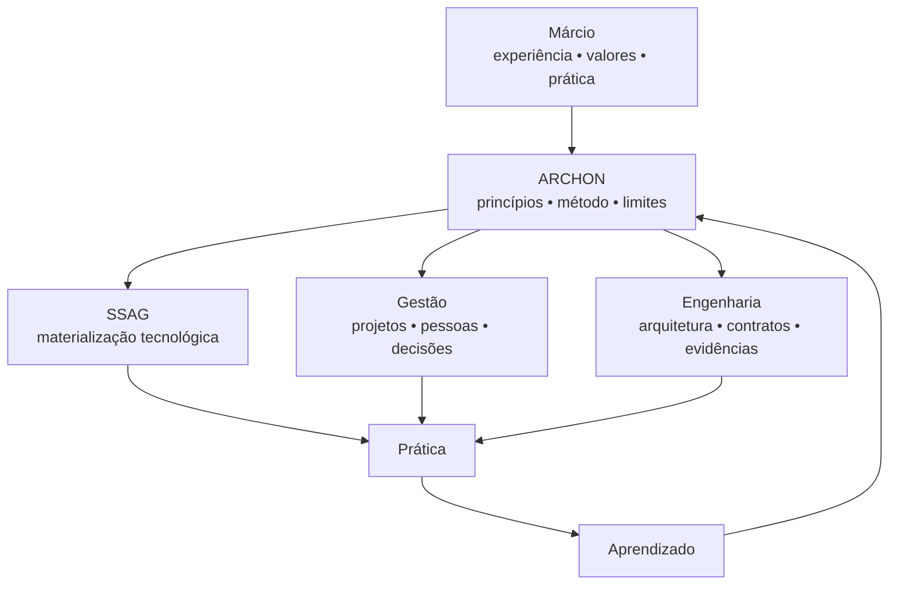
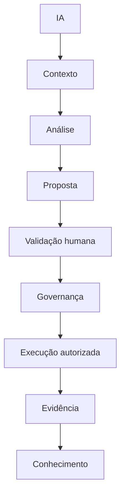
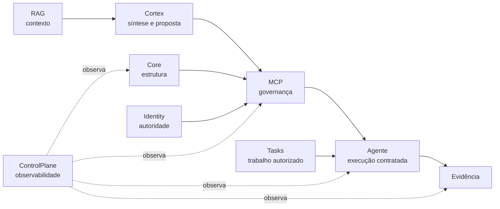

# 🜂 ARCHON

> **Construir com consciência.**
>
> Conhecimento antes da automação.  
> Arquitetura antes da complexidade.  
> Governança antes da autoridade.  
> Evidência antes da confiança.  
> Humanidade antes da conveniência.

ARCHON não é uma pessoa, cargo ou personagem.

**Márcio é a origem. ARCHON é a abstração. SSAG é uma manifestação. A prática é a prova.**

Este repositório registra uma filosofia de construção para a era da Inteligência Artificial: como ampliar a capacidade humana por meio de software, agentes e automação sem terceirizar julgamento, responsabilidade ou autoridade.

## A relação entre origem, filosofia e sistema

ARCHON nasceu de uma prática, mas não deve depender do seu autor para existir. Uma filosofia só se torna institucional quando pode ser compreendida, questionada, ensinada, aplicada e melhorada por outras pessoas.

## O problema que ARCHON tenta resolver

A IA reduziu radicalmente o custo de produzir software. Isso não reduziu na mesma proporção o custo de **compreender**, **validar**, **governar** e **responder** pelo software produzido.

ARCHON parte de uma tese simples:

> **Quanto maior a capacidade de execução de uma máquina, maior deve ser a qualidade do julgamento, dos limites e das evidências humanas ao seu redor.**

## O ciclo ARCHON

| Etapa | Pergunta central |
|---|---|
| Entender | O que existe e qual é o estado real? |
| Planejar | O que deve mudar, por quê e com quais riscos? |
| Governar | Quem pode decidir, executar e aprovar? |
| Construir | Como materializamos a intenção sem violar os limites? |
| Provar | Que evidência demonstra que funcionou? |
| Aprender | O que precisa virar conhecimento institucional? |

## Três leis operacionais

### 1. Sem estado conhecido, sem execução
Não alterar aquilo que ainda não foi suficientemente compreendido.

### 2. Nada é inferido quando deveria ser conhecido
Se uma informação estrutural pode ser consultada, não deve ser inventada por conveniência.

### 3. Evidência é parte do produto
Uma execução sem evidência é uma narrativa. Uma execução com evidência pode ser verificada.

## IA sob a filosofia ARCHON

A IA pode sugerir, analisar e executar sob contrato. Ela não recebe, por padrão, autoridade arquitetural nem responsabilidade moral.

## ARCHON e o SSAG

O SSAG funciona como laboratório dessa filosofia. Seus componentes procuram separar responsabilidades que não deveriam se concentrar numa única camada:

A arquitetura pode evoluir. O princípio permanece: **memória, decisão, execução e autoridade não devem se tornar uma única coisa por conveniência.**

## O que ARCHON não é

ARCHON não é:

- culto a processo;
- resistência à IA;
- defesa de programação manual;
- arquitetura como vaidade;
- gestão como controle de pessoas;
- documentação como fim em si mesma;
- promessa de infalibilidade.

ARCHON é uma disciplina para transformar potência em capacidade governável.

## Para ler

- [Manifesto ARCHON](MANIFESTO.md)
- [Princípios operacionais](docs/PRINCIPIOS.md)
- [ARCHON aplicado a pessoas e organizações](docs/PESSOAS-E-ORGANIZACOES.md)
- [Mapa SSAG ↔ ARCHON](docs/SSAG-COMO-EVIDENCIA.md)
- [Origem e evolução](docs/ORIGEM-E-EVOLUCAO.md)
- [Sustentabilidade, adoção e uso comercial](docs/SUSTENTABILIDADE-E-USO-COMERCIAL.md)
- [Histórico de mudanças](CHANGELOG.md)
- [Manifesto público v1](MANIFESTO-v1.md)
- [Manifesto original preservado](MANIFESTO-ORIGINAL.md)
- [Assinatura ARCHON](SIGNATURE_ARCHON.md)
- [Licença](LICENSE.md)

## Licença e evolução

Este manifesto deve poder evoluir com evidências. Mudanças relevantes nos princípios devem explicar **o que mudou, por que mudou e que experiência justificou a mudança**.

O conteúdo é disponibilizado sob [CC BY 4.0](LICENSE.md), preservando autoria,
liberdade de compartilhamento e adaptação responsável.

> **Uma filosofia que não pode ser questionada deixa de ser método e começa a virar dogma.**

---

**🜂 ARCHON — Construir com consciência.**
