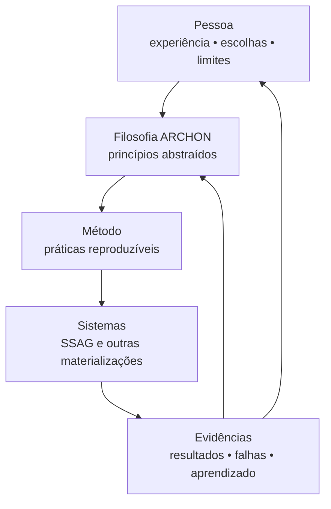

# Origem e evolução de ARCHON

## Relação entre pessoa, filosofia e sistema

### Márcio é a origem
A experiência concreta produz perguntas, padrões e decisões.

### ARCHON é a abstração
Os padrões deixam de depender da biografia de uma pessoa e passam a ser princípios discutíveis e transmissíveis.

### SSAG é uma manifestação
Uma arquitetura específica tenta materializar os princípios. Ela não define nem limita toda a filosofia.

### A prática é a prova
O valor de ARCHON não é medido pela elegância do texto, mas pela capacidade de produzir sistemas, decisões e organizações mais compreensíveis, responsáveis e evolutivas.

## Regra de evolução

Quando prática e manifesto divergirem, a divergência deve ser investigada.

Há três possibilidades legítimas:

1. a prática está errada e deve ser corrigida;
2. o princípio está incompleto e deve evoluir;
3. o contexto exige uma exceção que precisa ser explicitada.

A resposta ilegítima é esconder a divergência.
