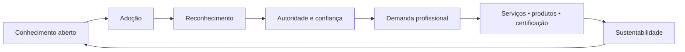
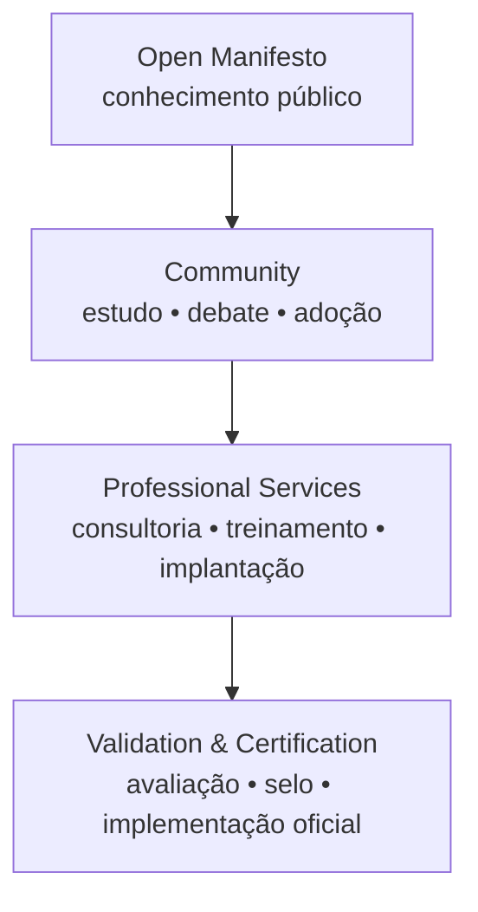

# Sustentabilidade, adoção e uso comercial

ARCHON foi concebido para circular como conhecimento aberto sem transformar sua origem em um bem invisível.

Este documento integra os documentos de apoio licenciados conforme [`LICENSE.md`](../LICENSE.md). Ele descreve diretrizes de sustentabilidade e adoção, mas não cria, por si só, programa de certificação, selo oficial ou registro de marca.

## Princípio econômico

> **O conhecimento circula. A autoria permanece. O valor especializado é remunerado.**

ARCHON não pretende cobrar pelo ato de uma pessoa pensar, estudar ou aplicar seus princípios. A sustentabilidade econômica deve surgir das atividades que exigem trabalho, responsabilidade, curadoria, validação ou entrega profissional.

## O que permanece aberto

Dentro dos termos da licença aplicável, podem permanecer abertos:

- o Manifesto ARCHON;
- os princípios filosóficos;
- os diagramas públicos;
- o ciclo ARCHON;
- referências acadêmicas, educacionais e comunitárias;
- estudos, debates e adaptações com atribuição adequada.

## Formas de apoio voluntário

Pessoas e organizações que considerem o trabalho útil podem apoiar sua continuidade por mecanismos voluntários de patrocínio ou doação oficialmente publicados pelo projeto.

Doação não compra autoridade sobre a filosofia, não cria certificação automática e não implica aprovação de uma implementação.

## Atividades que podem ser comerciais

A abertura do manifesto não impede atividades profissionais remuneradas, incluindo:

- consultoria ARCHON;
- diagnóstico de maturidade e governança;
- workshops e treinamento;
- formação de equipes;
- desenho de processos e arquitetura;
- implantação de práticas ARCHON;
- implementação e integração de ferramentas;
- serviços relacionados ao ecossistema SSAG;
- auditoria ou avaliação independente;
- programas de certificação;
- materiais educacionais ou ferramentas adicionais com licenciamento próprio;
- suporte, acompanhamento e implantação oficial.

## Certificação e implementação oficial

Uma organização pode aplicar os princípios ARCHON sem contratar o autor.

Entretanto, expressões como **certificado por ARCHON**, **implementação oficial**, **auditoria oficial**, **parceiro oficial** ou equivalentes devem ser reservadas a programas, contratos ou processos de validação explicitamente reconhecidos pelo mantenedor do projeto.

A liberdade de estudar ou aplicar a filosofia não equivale ao direito de sugerir endosso, certificação ou vínculo institucional inexistente.

## Marca, nome e identidade

A licença de copyright dos textos e diagramas não deve ser confundida com uma licença irrestrita sobre marcas, logotipos, selos ou identidades oficiais que possam ser adotados pelo projeto.

Até que exista uma política formal de marca, terceiros devem evitar representar suas ofertas como oficiais ou certificadas pelo ARCHON sem autorização expressa.

## Derivações

Uma forma recomendada de apresentação é:

> "Baseado em princípios do Manifesto ARCHON, de Márcio Costa. Esta adaptação é independente e não implica endosso do autor original."

## O modelo em quatro camadas

## Princípio final

> **Não vender a filosofia como pedágio intelectual. Construir valor econômico ao redor dela.**

Esse modelo busca evitar dois extremos: fechar o conhecimento a ponto de impedir sua adoção, ou abrir todas as formas de valor sem mecanismos para sustentar quem pesquisa, mantém, ensina e aplica o método.
